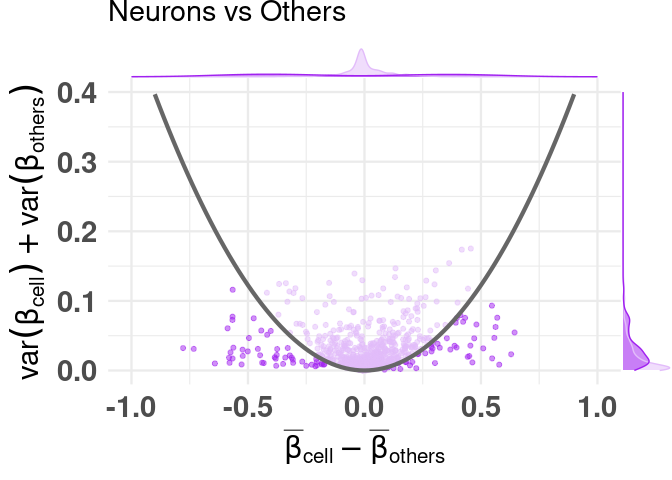

<!-- README.md is generated from README.Rmd. Please edit that file -->

# CimpleG 

## Overview

CimpleG, an R package to find (simple) CpG signatures.

<!-- badges: start -->

[](https://github.com/tiagomaie/CimpleG/actions)
<!-- badges: end -->

## Installation

``` r
# Install directly from github:
devtools::install_github("costalab/CimpleG")

# Alternatively, downloading it and install it from a local source:
#  - ie navigating through your system
install.packages(file.choose(), repos = NULL, type = "source")
#  - ie given a path to a local source
install.packages("~/Downloads/CimpleG_0.0.4.9002.tar.gz", repos = NULL, type = "source")
# or
devtools::install_local("~/Downloads/CimpleG_0.0.4.9002.tar.gz")
```

## Getting started

``` r
library("CimpleG")

data(train_data)
data(train_targets)
data(test_data)
data(test_targets)

# check the train_targets table to see
# what other columns can be used as targets
# colnames(train_targets)

# mini example with just 4 target signatures
set.seed(42)
cimpleg_result <- CimpleG(
  train_data = train_data,
  train_targets = train_targets,
  test_data = test_data,
  test_targets = test_targets,
  method = "CimpleG",
  target_columns = c(
    "CELL_TYPE_NEURONS",
    "CELL_TYPE_GLIA",
    "CELL_TYPE_BLOOD.CELLS",
    "CELL_TYPE_FIBROBLASTS"
  )
)

cimpleg_result$results
```

``` r
# check generated signatures
cimpleg_result$signatures
#>     CELL_TYPE_NEURONS        CELL_TYPE_GLIA CELL_TYPE_BLOOD.CELLS 
#>          "cg24548498"          "cg14501977"          "cg04785083" 
#> CELL_TYPE_FIBROBLASTS 
#>          "cg03369247"
```

### Plot generated signatures

``` r
# adjust target names to match signature names
train_targets$targets <- paste0("CELL_TYPE_",train_targets$CELL_TYPE)

# check generated signatures
plt <- signature_plot(
  cimpleg_result,
  train_data,
  train_targets,
  sample_id_column = "GSM",
  true_label_column = "targets"
)
print(plt$plot)
```

<!-- -->

## Difference of means vs Sum of variances (dmsv) plots

### basic plot

``` r
plt <- diffmeans_sumvariance_plot(
  data = train_data,
  target_vector = train_targets$CELL_TYPE_NEURONS == 1
)
print(plt)
```

<!-- -->

### adding color, highlighting selected features

``` r
df_dmeansvar <- compute_diffmeans_sumvar(
  data = train_data,
  target_vector = train_targets$CELL_TYPE_NEURONS == 1
)

parab_param <- .7

df_dmeansvar$is_selected <- select_features(
    x = df_dmeansvar$diff_means,
    y = df_dmeansvar$sum_variance,
    a = parab_param
)

plt <- diffmeans_sumvariance_plot(
  data = df_dmeansvar,
  label_var1 = "Neurons",
  color_all_points = "purple",
  threshold_func = function(x, a) (a * x) ^ 2,
  is_feature_selected_col = "is_selected",
  func_factor = parab_param
)
print(plt)
```

<!-- -->

### labeling specific features

``` r
plt <- diffmeans_sumvariance_plot(
  data = df_dmeansvar,
  feats_to_highlight = cimpleg_result$signatures
)
print(plt)
```

<!-- -->

## Deconvolution plots

### mini example with just 4 signatures

``` r
deconv_result <- run_deconvolution(
  cpg_obj = cimpleg_result,
  new_data = test_data
)

plt <- deconvolution_barplot(
  deconvoluted_data = deconv_result,
  meta_data = test_targets |> dplyr::mutate(CELL_TYPE = paste0("CELL_TYPE_", CELL_TYPE)),
  sample_id = "GSM",
  true_label = "CELL_TYPE"
)
print(plt$plot)
```

<!-- -->
