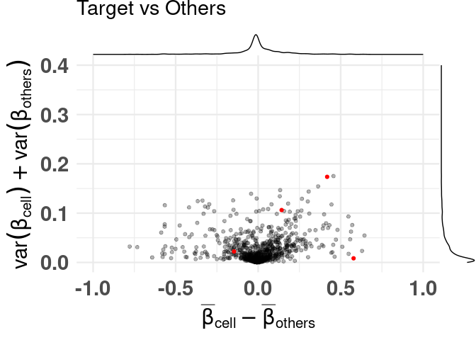
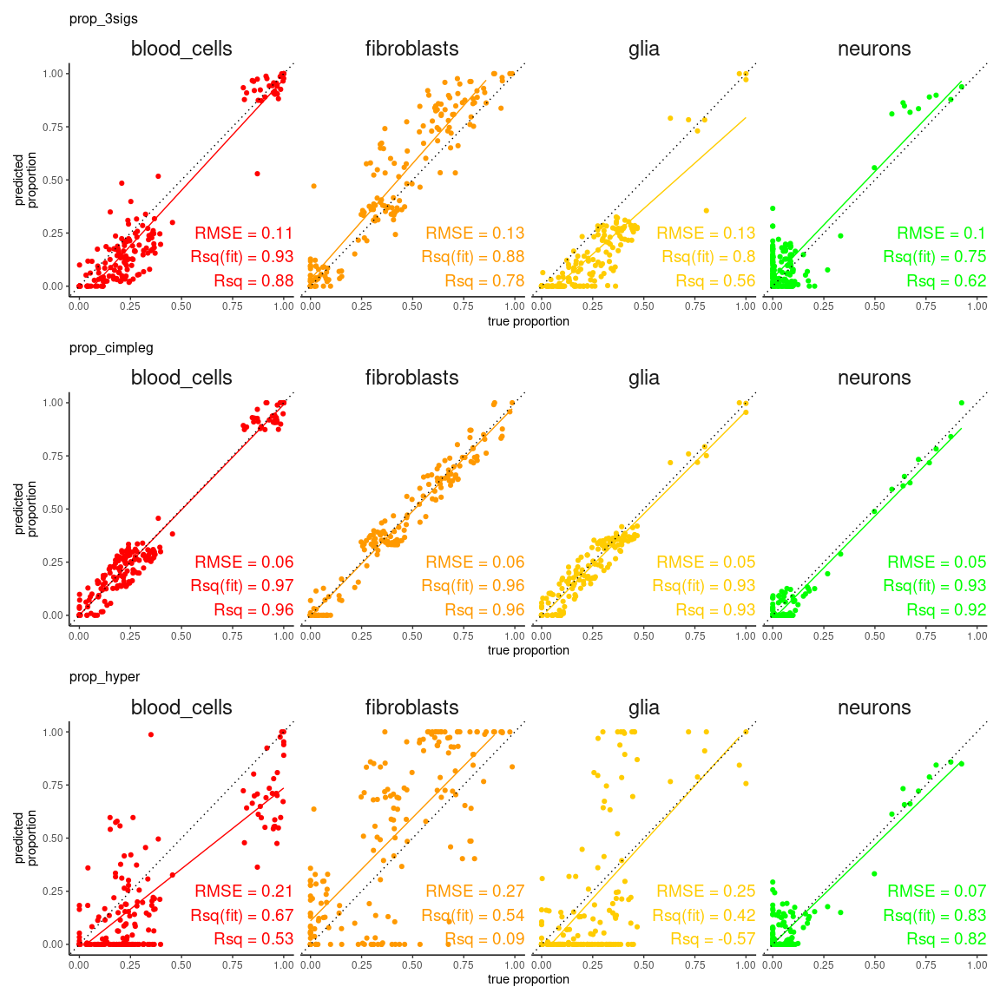
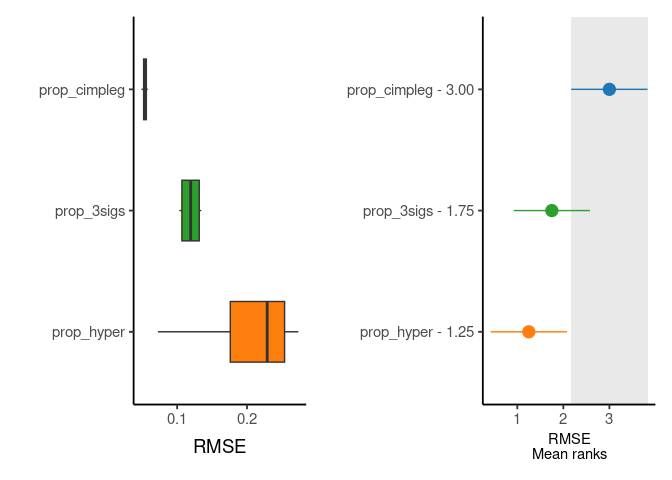

<!-- README.md is generated from README.Rmd. Please edit that file -->

# CimpleG 

## Overview

CimpleG, an R package to find (simple) CpG signatures.

<!-- badges: start -->

[](https://github.com/CostaLab/CimpleG/actions/workflows/R-CMD-check.yaml)
<!-- badges: end -->

## Installation

``` r
# Install directly from github:
devtools::install_github("costalab/CimpleG")

# Alternatively, downloading it and install it from a local source:
#  - ie navigating through your system
install.packages(file.choose(), repos = NULL, type = "source")
#  - ie given a path to a local source
install.packages("~/Downloads/CimpleG_0.0.4.XXXX.tar.gz", repos = NULL, type = "source")
# or
devtools::install_local("~/Downloads/CimpleG_0.0.4.XXXX.tar.gz")
```

## Getting started

``` r
library("CimpleG")

data(train_data)
data(train_targets)
data(test_data)
data(test_targets)

# check the train_targets table to see
# what other columns can be used as targets
# colnames(train_targets)

# mini example with just 4 target signatures
set.seed(42)
cimpleg_result <- CimpleG(
  train_data = train_data,
  train_targets = train_targets,
  test_data = test_data,
  test_targets = test_targets,
  method = "CimpleG",
  target_columns = c(
    "neurons",
    "glia",
    "blood_cells",
    "fibroblasts"
  )
)

cimpleg_result$results
```

``` r
# check generated signatures
cimpleg_result$signatures
#>      neurons         glia  blood_cells  fibroblasts 
#> "cg24548498" "cg14501977" "cg04785083" "cg03369247"
```

### Plot generated signatures

``` r

# adjust target names to match signature names

# check generated signatures
plt <- signature_plot(
  cimpleg_result,
  train_data,
  train_targets,
  sample_id_column = "gsm",
  true_label_column = "cell_type"
)
print(plt$plot)
```

<!-- -->

## Difference of means vs Sum of variances (dmsv) plots

### basic plot

``` r
plt <- diffmeans_sumvariance_plot(
  data = train_data,
  target_vector = train_targets$neurons == 1
)
print(plt)
```

<!-- -->

### adding color, highlighting selected features

``` r
df_dmeansvar <- compute_diffmeans_sumvar(
  data = train_data,
  target_vector = train_targets$neurons == 1
)

parab_param <- .7

df_dmeansvar$is_selected <- select_features(
    x = df_dmeansvar$diff_means,
    y = df_dmeansvar$sum_variance,
    a = parab_param
)

plt <- diffmeans_sumvariance_plot(
  data = df_dmeansvar,
  label_var1 = "Neurons",
  color_all_points = "purple",
  threshold_func = function(x, a) (a * x) ^ 2,
  is_feature_selected_col = "is_selected",
  func_factor = parab_param
)
print(plt)
```

<!-- -->

### labeling specific features

``` r
plt <- diffmeans_sumvariance_plot(
  data = df_dmeansvar,
  feats_to_highlight = cimpleg_result$signatures
)
print(plt)
```

<!-- -->

## Deconvolution plots

### mini example with just 4 signatures

``` r
deconv_result <- run_deconvolution(
  cpg_obj = cimpleg_result,
  new_data = test_data
)

plt <- deconvolution_barplot(
  deconvoluted_data = deconv_result,
  meta_data = test_targets,
  sample_id = "gsm",
  true_label = "cell_type"
)
print(plt$plot)
```

<!-- -->

### this example is a little more advanced

#### first lets create additional deconvolution results so that we can compare them

In this example, we’ll create two additional models made with CimpleG.
One using only hypermethylated signatures, and the other using 3 CpGs
per signature instead of just one.

``` r

set.seed(42)
cimpleg_hyper <- CimpleG(
  train_data = train_data,
  train_targets = train_targets,
  test_data = test_data,
  test_targets = test_targets,
  method = "CimpleG",
  pred_type = "hyper",
  target_columns = c(
    "neurons",
    "glia",
    "blood_cells",
    "fibroblasts"
  )
)
#> Training for target 'neurons' with 'CimpleG' has finished.: 0.406 sec elapsed
#> Training for target 'glia' with 'CimpleG' has finished.: 0.53 sec elapsed
#> Training for target 'blood_cells' with 'CimpleG' has finished.: 0.372 sec elapsed
#> Training for target 'fibroblasts' with 'CimpleG' has finished.: 0.332 sec elapsed

deconv_hyper <- run_deconvolution(
  cpg_obj = cimpleg_hyper,
  new_data = test_data
)


set.seed(42)
cimpleg_3sigs <- CimpleG(
  train_data = train_data,
  train_targets = train_targets,
  test_data = test_data,
  test_targets = test_targets,
  method = "CimpleG",
  n_sigs = 3,
  target_columns = c(
    "neurons",
    "glia",
    "blood_cells",
    "fibroblasts"
  )
)
#> Training for target 'neurons' with 'CimpleG' has finished.: 0.637 sec elapsed
#> Training for target 'glia' with 'CimpleG' has finished.: 0.602 sec elapsed
#> Training for target 'blood_cells' with 'CimpleG' has finished.: 0.441 sec elapsed
#> Training for target 'fibroblasts' with 'CimpleG' has finished.: 0.44 sec elapsed

deconv_3sigs <- run_deconvolution(
  cpg_obj = cimpleg_3sigs,
  new_data = test_data
)
```

#### let’s also create some fake true values just so that we can compare all the results

#### remember this is just an example, the results themselves are meaningless\!

``` r
deconv_3sigs$prop_3sigs <- deconv_3sigs$proportion
deconv_hyper$prop_hyper <- deconv_hyper$proportion
deconv_result$prop_cimpleg <- deconv_result$proportion

dummy_deconvolution_data <-
  deconv_result |> 
  dplyr::mutate(true_vals = proportion + runif(nrow(deconv_result), min=-0.1,max=0.1)) |>
  dplyr::select(cell_type,sample_id,prop_cimpleg,true_vals) |>
  dplyr::left_join(deconv_hyper |> dplyr::select(-proportion), by=c("sample_id","cell_type")) |>
  dplyr::left_join(deconv_3sigs |> dplyr::select(-proportion), by=c("sample_id","cell_type")) |>
  dplyr::mutate_if(is.numeric, function(x){ifelse(x<0,0,x)}) |>
  dplyr::mutate_if(is.numeric, function(x){ifelse(x>1,1,x)}) |> 
  tibble::as_tibble()
```

#### let’s now make use of some plotting functions designed to compare deconvolution results

#### first we can check how the true values compare against the predicted values

``` r
scatter_plts <- CimpleG:::deconv_pred_obs_plot(
  deconv_df = dummy_deconvolution_data,
  true_values_col = "true_vals",
  predicted_cols = c("prop_cimpleg","prop_hyper","prop_3sigs"),
  sample_id_col = "sample_id",
  group_col= "cell_type"
)
scatter_panel <- scatter_plts |> patchwork::wrap_plots(ncol=1)

print(scatter_panel)
```

<!-- -->

#### now, more interestingly, we can see in detail and rank one of the measures used to evaluate the deconvolution results

``` r
rank_plts <- CimpleG:::deconv_ranking_plot(
  deconv_df = dummy_deconvolution_data,
  true_values_col = "true_vals",
  predicted_cols = c("prop_cimpleg","prop_hyper","prop_3sigs"),
  sample_id_col = "sample_id",
  group_col= "cell_type",
  metrics = "rmse"
)
rank_panel <- list(rank_plts$perf_boxplt[[1]],rank_plts$nemenyi_plt[[1]]) |> patchwork::wrap_plots()

print(rank_panel)
```

<!-- -->
