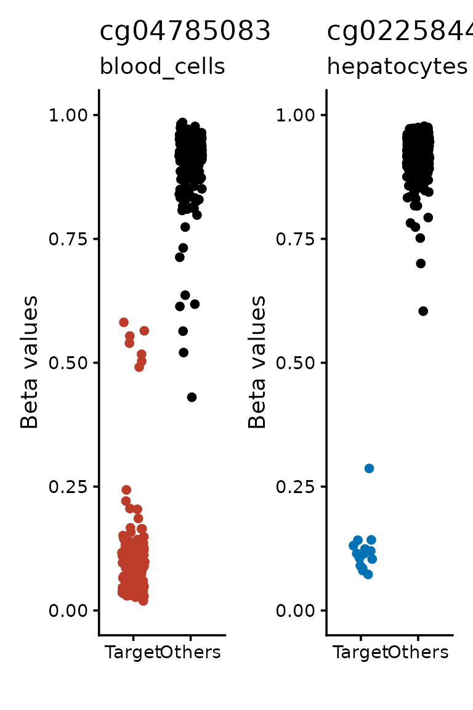

# Generate signatures

## CimpleG (Simple CpG signatures)

- CimpleG tries to find the CpGs that best classify a cell-type given a
  train dataset
- It also enables you to perform cell-type deconvolution in a couple of
  easy steps
- It can use beta or M values
- Here we show how easy it is to generate a signatures

### Installation

If you haven’t installed CimpleG, you can find the instructions to do so
[here](https://costalab.github.io/CimpleG/#installation). However it
should be as simple as:

``` r
if (!require("CimpleG")) devtools::install_github("costalab/CimpleG")
```

### Loading package

We load the CimpleG package.

``` r
library("CimpleG")
#> --------------------------
#> CimpleG version 1.0.0.0000
#> --------------------------
```

### Loading data

In this tutorial, we will use a small dataset with just 409 samples and
1000 CpGs. We will also use a table with metadata regarding these
samples. This dataset comes included with CimpleG. You can read more
about it here:
[](https://doi.org/10.5281/zenodo.15396278).

``` r
# load data
data(train_data)
data(train_targets)
```

### Running CimpleG

Running CimpleG can be quite simple. You just need to run the CimpleG
function with a few parameters.

``` r
# run CimpleG
cimpleg_result <- CimpleG(
  train_data,
  train_targets,
  target_columns = c("blood_cells", "hepatocytes"),
  train_only = TRUE
)
#> Training for target 'blood_cells' with 'CimpleG' has finished.: 2.062 sec elapsed
#> Training for target 'hepatocytes' with 'CimpleG' has finished.: 0.732 sec elapsed
```

Here we are generating signatures to find leukocytes and hepatocytes.

### Plotting CimpleG CpG signature

We can quickly visualize how our signature is able to separate the data.

``` r
sig_plt <-
  signature_plot(
    cimpleg_result,
    train_data,
    train_targets,
    sample_id_column = "gsm",
    true_label_column = "cell_type"
  )
sig_plt$plot
```


