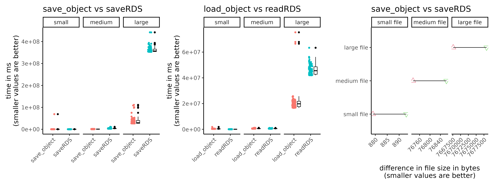

```{r, include = FALSE}
knitr::opts_chunk$set(
  collapse = TRUE,
  comment = "#>"
)
```

## CimpleG to save and load large files in R

* CimpleG comes with a couple of neat functions to save and load objects using state of the art data compression algorithms such as 'zstd' and 'lz4'.
  This allows you to much more quickly save or load R objects (.rds) files. Furthermore you can also use these functions to load any other .rds files.


### Loading the package

We load the CimpleG package.

```{r load_cimpleg}
library("CimpleG")
```

### Saving an object

By default we use the 'zstd' algorithm but you can choose a different one.
The process is pretty seamless.
Let's create a large matrix and save it using CimpleG.

```{r save_object, eval=FALSE, echo=TRUE}
my_matrix <- matrix(rnorm(100), nrow = 10, ncol = 10)

save_object(my_matrix, "my_matrix.rds")

```

### Loading an object

To load an object the process is just as seamless.
You do not need to specify which compression algorithm was used.
It should just work!
```{r load_object, eval=FALSE, echo=TRUE}
my_loaded_matrix <- load_object("my_matrix.rds")

my_loaded_matrix
```


### Quick benchmark results to show how much faster and efficient saving/loading data with these functions is

{width=100%}


The larger the file the greater the advantage will be when using these functions.


